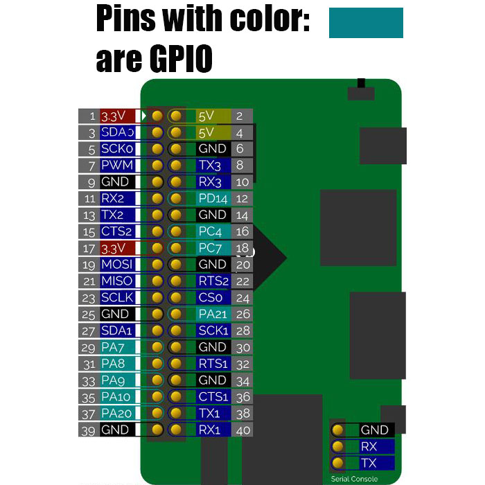

https://www.rubydoc.info/gems/mpg123_remote/0.0.1
https://github.com/georgi/mpg123/blob/master/doc/README.remote
https://docs.armbian.com/User-Guide_Armbian-Config/
https://github.com/orangepi-xunlong/wiringOP
https://www.npmjs.com/package/orange-pi-gpio


Pin 0 below is taken from wPi value, physical ping for which is 3
```
let gpioPin = new Gpio({
pin: 0, mode: 'out'})
```

```
 +------+-----+----------+------+---+OrangePiH3+---+------+----------+-----+------+
 | GPIO | wPi |   Name   | Mode | V | Physical | V | Mode | Name     | wPi | GPIO |
 +------+-----+----------+------+---+----++----+---+------+----------+-----+------+
 |      |     |     3.3V |      |   |  1 || 2  |   |      | 5V       |     |      |
 |   12 |   0 |    SDA.0 |  OUT | 0 |  3 || 4  |   |      | 5V       |     |      |
 |   11 |   1 |    SCL.0 |  OFF | 0 |  5 || 6  |   |      | GND      |     |      |
 |    6 |   2 |      PA6 |  OFF | 0 |  7 || 8  | 0 | OFF  | TXD.3    | 3   | 13   |
 |      |     |      GND |      |   |  9 || 10 | 0 | OFF  | RXD.3    | 4   | 14   |
 |    1 |   5 |    RXD.2 |  OFF | 0 | 11 || 12 | 0 | IN   | PD14     | 6   | 110  |
 |    0 |   7 |    TXD.2 |  OFF | 0 | 13 || 14 |   |      | GND      |     |      |
 |    3 |   8 |    CTS.2 |  OFF | 0 | 15 || 16 | 0 | OFF  | PC04     | 9   | 68   |
 |      |     |     3.3V |      |   | 17 || 18 | 0 | OFF  | PC07     | 10  | 71   |
 |   64 |  11 |   MOSI.0 |  OUT | 0 | 19 || 20 |   |      | GND      |     |      |
 |   65 |  12 |   MISO.0 |  OUT | 0 | 21 || 22 | 0 | OFF  | RTS.2    | 13  | 2    |
 |   66 |  14 |   SCLK.0 |  OFF | 0 | 23 || 24 | 0 | OFF  | CE.0     | 15  | 67   |
 |      |     |      GND |      |   | 25 || 26 | 0 | OFF  | PA21     | 16  | 21   |
 |   19 |  17 |    SDA.1 |  OFF | 0 | 27 || 28 | 0 | OFF  | SCL.1    | 18  | 18   |
 |    7 |  19 |     PA07 |  OFF | 0 | 29 || 30 |   |      | GND      |     |      |
 |    8 |  20 |     PA08 |  OFF | 0 | 31 || 32 | 0 | OFF  | RTS.1    | 21  | 200  |
 |    9 |  22 |     PA09 |  OFF | 0 | 33 || 34 |   |      | GND      |     |      |
 |   10 |  23 |     PA10 |  OFF | 0 | 35 || 36 | 0 | OFF  | CTS.1    | 24  | 201  |
 |   20 |  25 |     PA20 |  OFF | 0 | 37 || 38 | 0 | OFF  | TXD.1    | 26  | 198  |
 |      |     |      GND |      |   | 39 || 40 | 0 | OFF  | RXD.1    | 27  | 199  |
 +------+-----+----------+------+---+----++----+---+------+----------+-----+------+
 | GPIO | wPi |   Name   | Mode | V | Physical | V | Mode | Name     | wPi | GPIO |
 +------+-----+----------+------+---+OrangePiH3+---+------+----------+-----+------+
```



